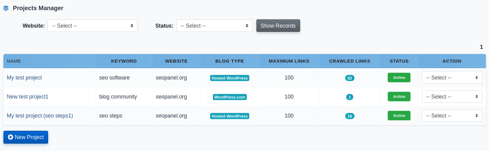
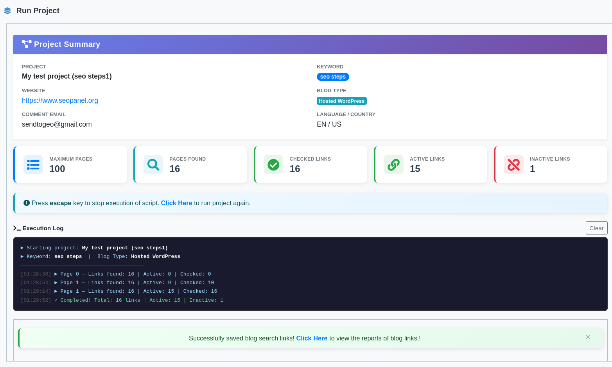
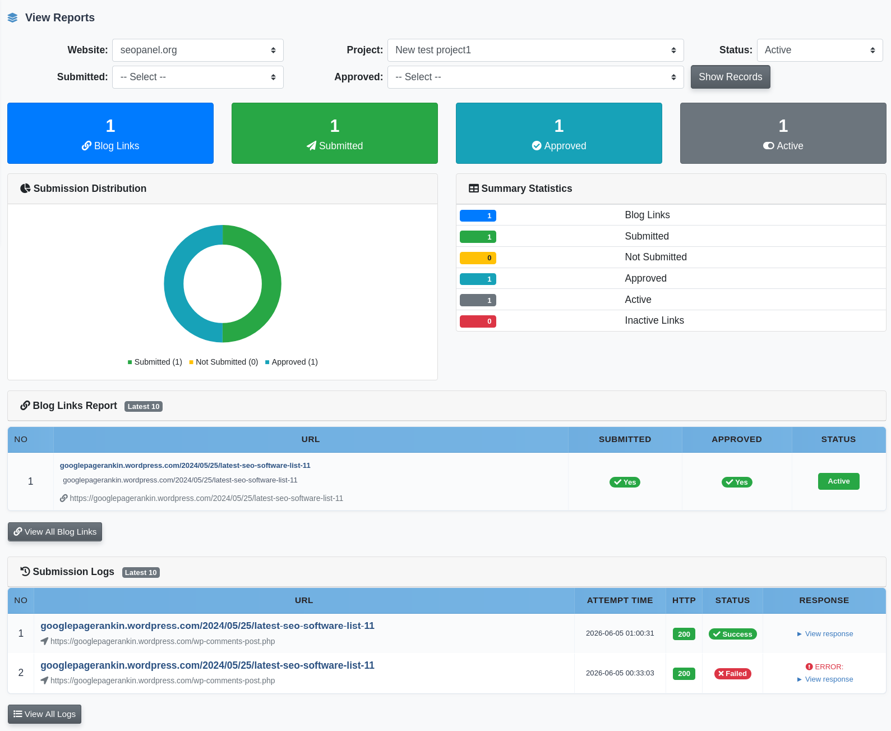
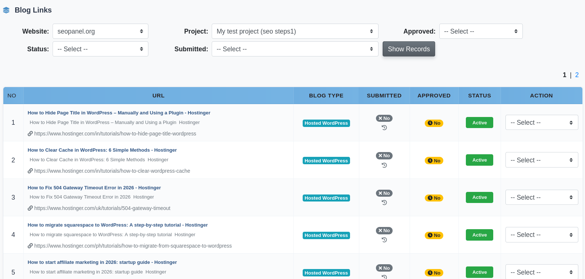
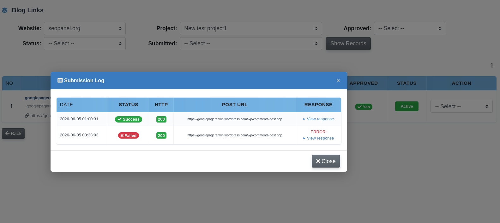
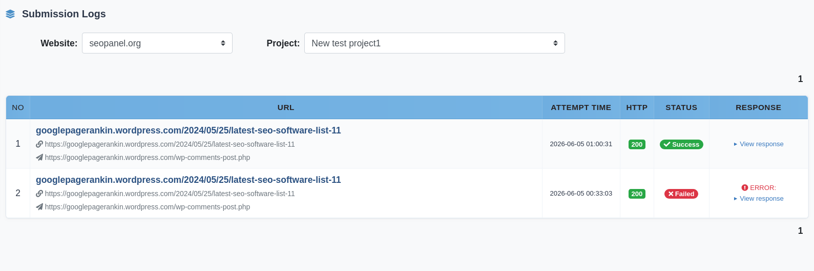

.. title:: Blog Community Plugin for SEO Panel | Automated Blog Discovery & Comment Submission

.. meta::
   :description: Blog Community plugin for SEO Panel automatically crawls Google News RSS feeds to find blog posts by keyword across WordPress, Blogger, Reddit and more — submit comments with backlinks using up to 10 templates per project.
   :keywords: blog community plugin, seo panel blog community, automated blog commenting, blog comment backlinks, google news rss blog discovery, seo panel comment submission, multi-platform blog outreach

Blog Community
~~~~~~~~~~~~~~

.. raw:: html

   

     

       

         <i class="fa fa-comments" style="color: #fff; font-size: 22px;"></i>
       

       

         

           Blog Community Plugin
           v3.0.0
         

         
Discover blogs via <strong style="color:#fff;">Google News RSS</strong> and auto-submit comments across WordPress, Blogger, Reddit &amp; more.

       

     

     <a href="https://www.seopanel.org/plugin/l/12/blog-community/" target="_blank"
        style="display: inline-flex; align-items: center; gap: 8px; background: #fff; color: #1e40af; padding: 10px 22px; border-radius: 7px; font-weight: 700; font-size: 14px; text-decoration: none; box-shadow: 0 2px 8px rgba(0,0,0,0.18); white-space: nowrap; transition: opacity .2s;"
        onmouseover="this.style.opacity='.88'" onmouseout="this.style.opacity='1'">
       <i class="fa fa-download"></i> Download
     </a>
   

Blog Community automatically crawls Google News RSS feeds to find blog posts matching your target keyword across platforms like WordPress, Blogger, Reddit, and more — then submits comments with your backlink to those posts. Each project stores up to 10 comment templates that are rotated during submission, and every submission is logged with HTTP status, response, and error details so you can track which comments have been submitted and approved.

Requires **SEO Panel 6.0.0** or higher.

The plugin menu provides the following sections:

- **Projects Manager** – Create and manage blog commenting campaigns per website
- **View Reports** – Browse discovered blog links, submit comments, and review submission logs
- **Import Project Links** – Manually add blog URLs to an existing project
- **Cron Command** – Set up automated comment submission (admin only)
- **Plugin Settings** – Configure user access and submission limits (admin only)

~~~~~~~~~~~~~~~~
Projects Manager
~~~~~~~~~~~~~~~~

Projects Manager lists all blog community campaigns. Each project shows its keyword, website, language, maximum links limit, crawled links count, and status.

Filter the list by **Website** to focus on a specific site.

**Creating a New Project**

1. Click **New Project**
2. Enter the project **Name**
3. Enter the **Keyword** — used to search Google News RSS feeds for relevant blog posts (e.g. ``seo tips``, ``wordpress tutorials``)
4. Select the **Website** the backlinks will point to
5. Enter the **Link Title** — the anchor text used when your link is inserted into the comment. Multiple title variations can be separated by pipe ``|`` (e.g. ``SEO Panel|SEO Tool|Free SEO Software``)
6. Enter the **Comment Email** — the email address submitted with each comment
7. Select the **Language** and **Country** for the blog search
8. Enter the **Maximum Blog Links** — how many blog URLs to discover and store (max set in Plugin Settings)
9. Enter up to **10 comment templates** (Comment 1 through Comment 10). Comment 1 is required; the rest are optional. The plugin rotates through these during submission for variety
10. Click **Proceed** to save

**Project Actions**

- **Run Project** – Start the keyword crawl to discover blog URLs
- **View Reports** – Open the report view for this project to submit and track comments
- **Import Links** – Manually add blog URLs to this project
- **Copy Project** – Duplicate this project (useful for creating variations)
- **Activate / Inactivate** – Toggle the project's status
- **Edit** – Modify project settings
- **Delete** – Remove the project

~~~~~~~~~~~~~~~~~~~
Supported Platforms
~~~~~~~~~~~~~~~~~~~

Blog Community supports posting to multiple blogging platforms. Platform support is actively expanding:

+---------------------+----------------+
| Platform            | Status         |
+=====================+================+
| WordPress.com       | Active         |
+---------------------+----------------+
| Hosted WordPress    | Active         |
+---------------------+----------------+
| Blogger / Blogspot  | Coming Soon    |
+---------------------+----------------+
| Tumblr              | Coming Soon    |
+---------------------+----------------+
| Reddit              | Coming Soon    |
+---------------------+----------------+
| LiveJournal         | Coming Soon    |
+---------------------+----------------+
| Medium              | Coming Soon    |
+---------------------+----------------+

~~~~~~~~~~~
Run Project
~~~~~~~~~~~

Running a project starts the Google News RSS crawl. SEO Panel queries the RSS feed using the project's keyword and country/language settings, collects matching blog post URLs, and saves them into the project's link list.

The Run Project view shows a live console with timestamped entries:

- **Pages Found** – Total blog URLs discovered so far
- **Checked Links** – Links verified as accessible
- **Active Links** – Links confirmed as live
- **Inactive Links** – Links that returned an error

The crawl proceeds automatically, loading a batch of results, then waiting before the next batch. Click the **Click Here to run project** link to restart or continue the crawl manually. Press **Escape** to stop.

Once the crawl completes, a success message confirms the number of links saved and directs you to View Reports to begin submitting comments.

~~~~~~~~~~~~
View Reports
~~~~~~~~~~~~

View Reports is where you submit comments and track their status. The dashboard includes stat cards with summary statistics, a submission distribution donut chart, and a latest submission logs preview.

Filter the link list by:

- **Website** and **Project**
- **Status** – Active or Inactive links
- **Submitted** – Yes / No (whether a comment has been submitted)
- **Approved** – Yes / No (whether the submitted comment was approved by the blog)

Each link entry shows the blog title, description, URL, submission status, approval status, and active status. Every comment submission is logged with HTTP status code, response body, and error details.

**Link Actions**

- **Submit Comment** – Submit a comment to this blog (only available for links not yet submitted, if permission is granted)
- **Check Submission** – Re-check the approval status of a previously submitted comment
- **Check Status** – Verify the link is still live
- **Activate / Inactivate** – Include or exclude this link from submissions
- **Delete** – Remove the link from the project

~~~~~~~~~~~~~~~~~~~~
Import Project Links
~~~~~~~~~~~~~~~~~~~~

Import Project Links lets you manually add known blog URLs to an existing project — useful when you already have a list of target blogs. Duplicate URLs are validated automatically.

1. Select the **Project**
2. Paste the blog URLs into the **URLs** field, separated by commas

   *Example:* ``https://www.example-blog.com/post-1, https://www.another-blog.com/article``

3. Click **Proceed**

The imported links are added to the project's link list and are immediately available in View Reports for comment submission.

~~~~~~~~~~~~
Cron Command
~~~~~~~~~~~~

The Cron Command section (admin only) provides the server command to automate blog link discovery and comment submission on a schedule. Access via **Admin Panel → Blog Community → Cron Command** for the pre-filled command for your installation.

~~~~~~~~~~~~~~~
Plugin Settings
~~~~~~~~~~~~~~~

- **Allow user to access project manager** – When enabled, non-admin users can create and manage projects, run projects, view reports and import links
- **Allow user to submit comment to blog** – When enabled, non-admin users can submit comments from the View Reports section
- **Allow user to submit comment to a blog more than one time** – When enabled, the same blog URL can receive multiple comment submissions from the same project
- **Maximum number of blog links per project** – The maximum number of blog URLs that can be collected per project (default: 100)
