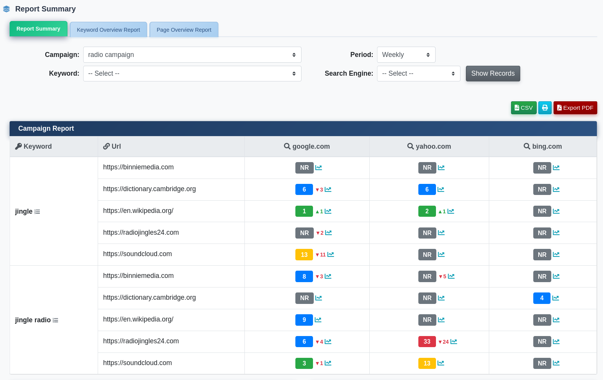
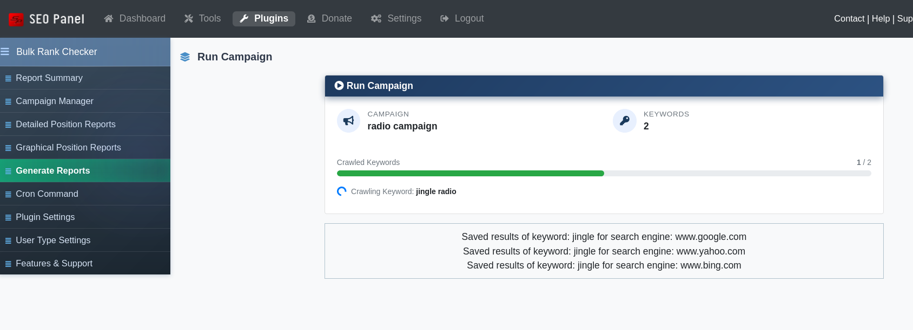
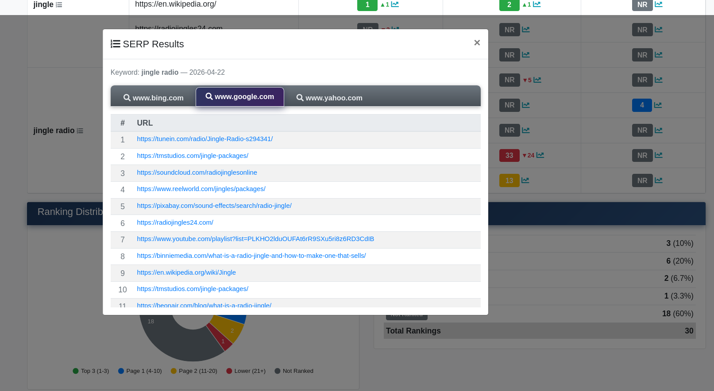

.. title:: Bulk Keyword Rank Checker Plugin for SEO Panel | Multi-URL Position Tracker

.. meta::
   :description: Bulk Keyword Rank Checker plugin for SEO Panel tracks keyword rankings for multiple URLs and search engines simultaneously, with PDF/CSV/HTML reports, SERP viewer, graphical charts and email delivery.
   :keywords: bulk keyword rank checker, seo panel bulk rank checker, keyword position tracker, multi url rank checker, serp results viewer, seo panel rank reports

Bulk Keyword Rank Checker
~~~~~~~~~~~~~~~~~~~~~~~~~~

.. raw:: html

   

     

       

         <i class="fa fa-bar-chart" style="color: #fff; font-size: 22px;"></i>
       

       

         

           Bulk Keyword Rank Checker Plugin
           v3.0.0
         

         
Track rankings for <strong style="color:#fff;">multiple keywords &amp; URLs</strong> simultaneously — PDF, CSV &amp; HTML reports with SERP viewer.

       

     

     <a href="https://www.seopanel.org/plugin/l/49/bulk-keyword-rank-checker/" target="_blank"
        style="display: inline-flex; align-items: center; gap: 8px; background: #fff; color: #1e3a5f; padding: 10px 22px; border-radius: 7px; font-weight: 700; font-size: 14px; text-decoration: none; box-shadow: 0 2px 8px rgba(0,0,0,0.18); white-space: nowrap; transition: opacity .2s;"
        onmouseover="this.style.opacity='.88'" onmouseout="this.style.opacity='1'">
       <i class="fa fa-download"></i> Download
     </a>
   

Bulk Keyword Rank Checker tracks the search engine position of multiple keywords across multiple URLs and search engines simultaneously — within a single campaign. It generates detailed HTML, PDF and CSV reports, provides a SERP results popup viewer, supports graphical trend charts, and delivers reports via email on a schedule.

The plugin menu provides the following sections:

- **Report Summary** – Dashboard overview of all campaign ranking results
- **Campaign Manager** – Create and manage bulk rank checking campaigns
- **Detailed Position Reports** – Per-keyword, per-URL position data with filtering
- **Graphical Position Reports** – Visual ranking trend charts
- **Generate Reports** – Manually trigger report generation (admin, if enabled)
- **Cron Command** – Set up automated report generation (admin only)
- **Plugin Settings** – Configure access and cron behaviour (admin only)
- **User Type Settings** – Per-user-type keyword and link limits (admin only)

~~~~~~~~~~~~~~
Report Summary
~~~~~~~~~~~~~~

The Report Summary dashboard gives an at-a-glance view of all campaign performance. It shows ranking trends, keyword movement (up/down), top-ranked keywords and position distribution across all active campaigns.

~~~~~~~~~~~~~~~~
Campaign Manager
~~~~~~~~~~~~~~~~

Campaign Manager is where bulk rank checking campaigns are created. Each campaign defines the target website, language, country, search engines, keywords and URLs to track.

**Creating a New Campaign**

1. Click **New Campaign**
2. Select the **Website**
3. Enter the campaign **Name**
4. Select the **Language**
5. Select the **Country**
6. Select one or more **Search Engines** (use Select All to check all active engines)
7. Paste the **Keywords** to track (one per line)
8. Paste the **Links** (URLs) to check rankings for (one per line)
9. Set **Execute with cron** to Yes to include this campaign in automated runs
10. Set the **Reports generation interval** (Daily, Weekly, etc.)
11. Click **Proceed** to save

**Campaign Actions**

- **Run** – Start crawling ranks immediately for this campaign
- **Reports** – View detailed position results for this campaign
- **Activate / Inactivate** – Toggle campaign status
- **Edit** – Modify campaign settings
- **Delete** – Remove the campaign

~~~~~~~~~~~~
Run Campaign
~~~~~~~~~~~~

The Run Campaign view shows a progress bar as keywords are being crawled, displaying the number of crawled keywords vs. total and the percentage complete. Once finished, results are available in the report views.

~~~~~~~~~~~~~~~~~~~~~~~~~
Detailed Position Reports
~~~~~~~~~~~~~~~~~~~~~~~~~

Detailed Position Reports shows the exact rank position for each keyword–URL–search engine combination. Use the filters to drill down by campaign, keyword, link and date range.

Click any result row to open the **SERP Results** popup, which displays the actual top search results returned for that keyword on that search engine — useful for competitive analysis.

Export options include HTML, PDF and CSV formats.

~~~~~~~~~~~~~~~~~~~~~~~~~~
Graphical Position Reports
~~~~~~~~~~~~~~~~~~~~~~~~~~

Graphical Position Reports renders ranking trend charts over time for each keyword and URL combination. Visualise position movement, identify trends, and spot drops or improvements at a glance.

~~~~~~~~~~~~~~~~
Generate Reports
~~~~~~~~~~~~~~~~

The Generate Reports section (admin only, if enabled via settings) lets you manually trigger report generation for one or all campaigns directly from the user interface, without requiring cron access.

~~~~~~~~~~~~
Cron Command
~~~~~~~~~~~~

The Cron Command section provides the server crontab command to automate report generation on a schedule. Access it via **Admin Panel → Bulk Keyword Rank Checker → Cron Command** for the pre-filled command with your installation path.

~~~~~~~~~~~~~~~
Plugin Settings
~~~~~~~~~~~~~~~

- **Allow user to access the campaign manager** – When enabled, non-admin users can create and manage campaigns and view reports
- **Number of keywords in cron job** – How many keywords are processed per cron execution (default: 1)
- **Enable reports generation from user interface** – When enabled, the Generate Reports menu item is shown to admins

~~~~~~~~~~~~~~~~~~
User Type Settings
~~~~~~~~~~~~~~~~~~

User Type Settings (admin only) defines per-user-type limits on the number of keywords and links allowed per campaign, enabling tiered access for different subscription levels.
