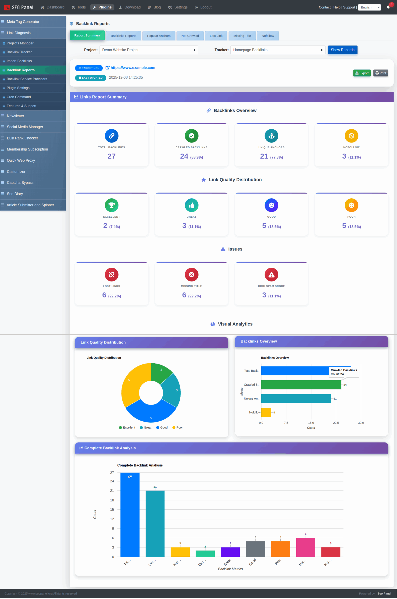
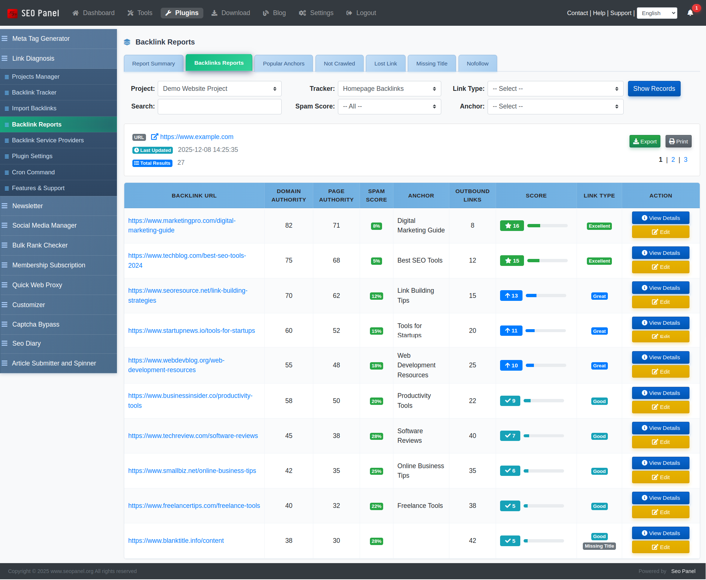
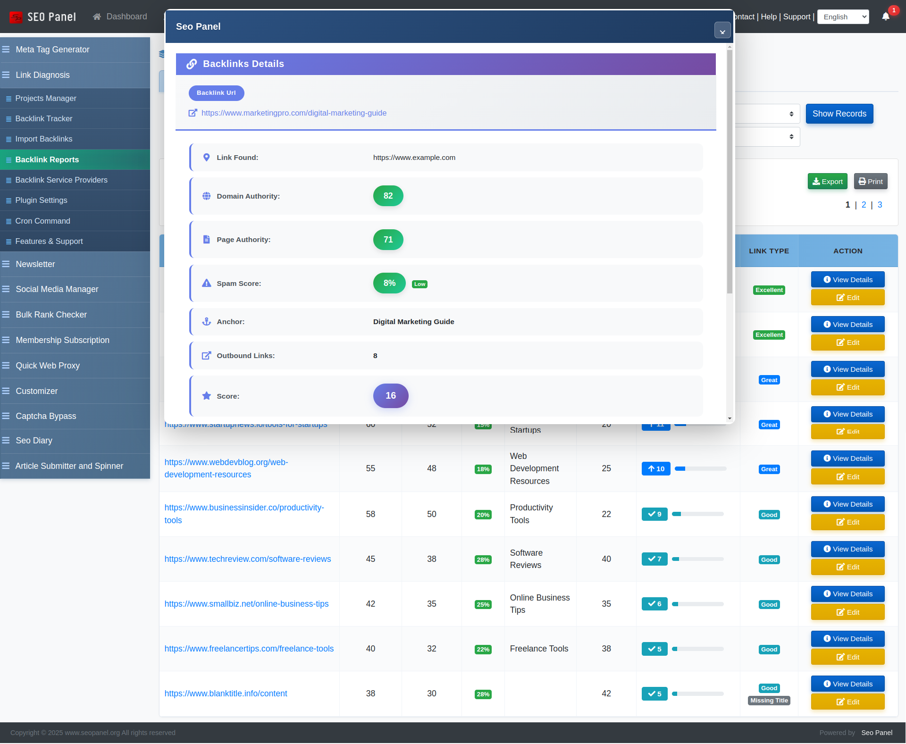
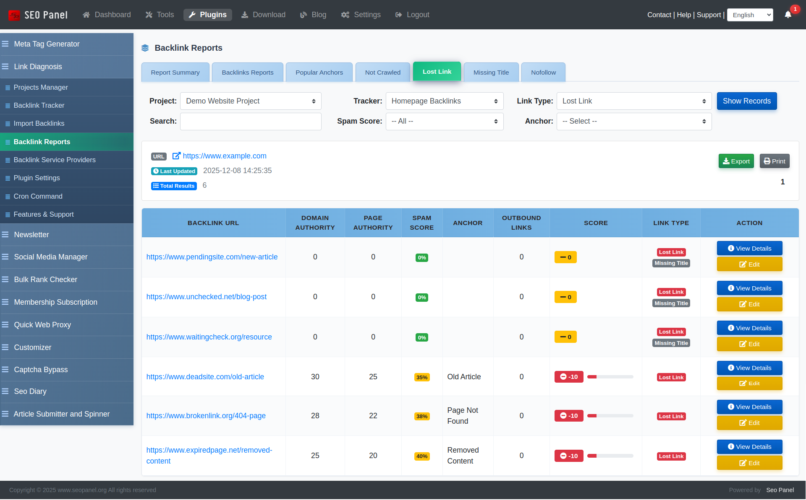
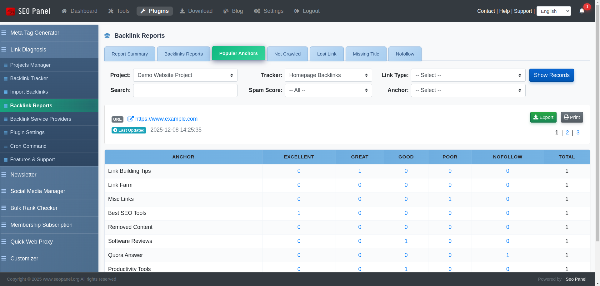

.. title:: Link Diagnosis Plugin for SEO Panel | Backlink Tracker & Analysis

.. meta::
   :description: Link Diagnosis is an SEO Panel plugin for detailed backlink reports, competitor link tracking, anchor analysis, lost link detection and automated cron-based report generation.
   :keywords: link diagnosis plugin, seo panel backlink tracker, backlink analysis tool, competitor backlink tracking, seo panel plugin, anchor text report

Link Diagnosis
~~~~~~~~~~~~~~

.. raw:: html

   

     

       

         <i class="fa fa-stethoscope" style="color: #fff; font-size: 22px;"></i>
       

       

         

           Link Diagnosis Plugin
           v4.0.0
         

         
Detailed backlink reports &amp; <strong style="color:#fff;">competitor link tracking</strong> &mdash; uncover every link building opportunity.

       

     

     <a href="https://www.seopanel.org/plugin/l/3/link-diagnosis/" target="_blank"
        style="display: inline-flex; align-items: center; gap: 8px; background: #fff; color: #0f766e; padding: 10px 22px; border-radius: 7px; font-weight: 700; font-size: 14px; text-decoration: none; box-shadow: 0 2px 8px rgba(0,0,0,0.18); white-space: nowrap; transition: opacity .2s;"
        onmouseover="this.style.opacity='.88'" onmouseout="this.style.opacity='1'">
       <i class="fa fa-download"></i> Download
     </a>
   

Link Diagnosis is a powerful SEO Panel plugin that gives you complete visibility into your backlink profile. Track backlinks for your own websites and your competitors, analyse anchor text distribution, identify lost or broken links, and generate scheduled reports automatically — all from within SEO Panel.

The plugin menu provides the following sections:

- **Projects Manager** – Organise your backlink tracking by project and website
- **Backlink Tracker** – Create and manage backlink tracking reports per project
- **Import Backlinks** – Manually import known backlinks into a tracker
- **Backlink Reports** – View, filter and analyse all collected backlink data
- **Backlink Service Providers** – Configure API providers for backlink data (admin only)
- **Plugin Settings** – Configure global defaults and user permissions (admin only)
- **Cron Command** – Set up automated report generation (admin only)

~~~~~~~~~~~~~~~~
Projects Manager
~~~~~~~~~~~~~~~~

Projects Manager is used to organise your backlink tracking work. Each project belongs to a website and can contain multiple backlink trackers.

The list can be filtered by **Website** and **Status** (Active / Inactive).

**Creating a New Project**

To create a new project:

1. Click **New Project**

2. Select the **Website** the project belongs to

3. Enter a **Name** for the project

4. Click **Proceed** to save

**Project Actions**

Each project in the list supports the following actions:

- **Trackers** – View the backlink trackers for this project
- **Activate / Inactivate** – Toggle the project's status
- **Edit** – Rename or reassign the project
- **Delete** – Remove the project and all associated trackers

~~~~~~~~~~~~~~~~
Backlink Tracker
~~~~~~~~~~~~~~~~

Backlink Tracker is where you create and manage the actual backlink crawl reports for each project. Each tracker targets a specific URL and fetches its backlink data from the configured service provider.

The list shows each tracker with its project, target URL, service provider, maximum links limit, total backlinks found, crawled backlinks, progress status and last updated date.

**Progress States**

- **Not Started** – The tracker has been created but not yet run
- **In Complete** – The crawl is partially complete
- **Completed** – All backlinks have been fetched and are ready to view

**Creating a New Tracker**

To create a new backlink tracker:

1. Navigate to **Backlink Tracker** and select a **Project**

2. Click **Backlink Tracker** (the New button)

3. Select the **Project**

4. Enter a **Name** for the tracker

5. Enter the **URL** to track backlinks for (e.g. your website or a competitor's page)

6. Set the **Maximum Links** — the maximum number of backlinks to fetch (subject to your plan limit)

7. Select the **Backlinks Service Provider** — the API source used to fetch backlink data

8. Click **Proceed** to save

**Tracker Actions**

- **Run** – Start fetching backlinks from the service provider
- **Import Backlinks** – Manually add links to this tracker
- **Backlink Reports** – View the collected backlink data
- **Reverify Backlinks** – Re-check the status of all collected links
- **Recheck Reports** – Re-run the crawl for a completed tracker
- **Activate / Inactivate** – Toggle the tracker's status
- **Edit** – Modify tracker settings
- **Delete** – Remove the tracker

~~~~~~~~~~~~~~~~
Import Backlinks
~~~~~~~~~~~~~~~~

Import Backlinks lets you manually add known backlink URLs into any existing tracker — useful when you already have a list of links that you want to monitor.

To import backlinks:

1. Select the **Project**

2. Select the **Tracker**

3. Paste the backlink URLs into the **Links** field, separated by commas

   *Example:* ``https://www.example.com/, https://www.example.com/page``

4. Click **Proceed**

An import summary is shown after submission, displaying the count of **Valid**, **Invalid** and **Duplicate** links.

~~~~~~~~~~~~~~~~
Backlink Reports
~~~~~~~~~~~~~~~~

Backlink Reports is the main analysis view. It shows all backlinks collected for a selected project and tracker, with powerful filtering and multiple report types.

**Report Type Tabs**

Switch between report views using the tabs at the top:

- **All Backlinks** – Full list of all collected backlinks
- **Report Summary** – Aggregated overview of the entire backlink profile
- **Lost Links** – Links that were previously found but are now broken or missing
- **Missing Title** – Backlinks where the linking page has no title tag
- **Nofollow Links** – Backlinks with a ``rel="nofollow"`` attribute

**Filters**

- **Project** – Select the project
- **Tracker** – Select the specific backlink tracker
- **Link Type** – Filter by All, Broken, Missing, or Nofollow
- **Search** – Full-text search across link URLs and anchor text
- **Spam Score** – Filter by Low (1–30%), Medium (31–60%) or High (61–100%) spam score
- **Anchor** – Filter by a specific anchor text

~~~~~~~~~~~~~~~~
Backlink Details
~~~~~~~~~~~~~~~~

Clicking any backlink in the report opens its detail view, which shows:

- Source URL and target URL
- Anchor text and link type (dofollow / nofollow)
- Domain authority and spam score
- HTTP status code
- First seen and last checked dates

~~~~~~~~~~~
Lost Links
~~~~~~~~~~~

The **Lost Links** tab highlights backlinks that were previously active but are no longer found at the source page. Use this report to:

- Identify backlinks that need to be reclaimed
- Contact webmasters to restore removed links
- Prioritise link recovery campaigns

Each lost link shows the source URL, anchor text, last known status and the date it was last seen.

~~~~~~~~~~~~~~~
Report Summary
~~~~~~~~~~~~~~~

The **Report Summary** tab provides an aggregated overview of your entire backlink profile for the selected tracker.

It includes:

- Total backlinks and crawled backlinks count
- Unique anchor text count
- Dofollow vs. nofollow breakdown
- Spam score distribution (Low / Medium / High)
- Link type breakdown (Active, Broken, Missing, Nofollow)

Export and Print options are available for sharing or archiving the summary.

~~~~~~~~~~~~~~~
Anchor Reports
~~~~~~~~~~~~~~~

The **Anchor Reports** section (accessible from the report view) shows the distribution of anchor text across all backlinks in the selected tracker. For each anchor you can see:

- Anchor text string
- Number of backlinks using that anchor
- Percentage share of total anchors

Export and Print options are available.

~~~~~~~~~~~~~~~~~~~~~~~~~~
Backlink Service Providers
~~~~~~~~~~~~~~~~~~~~~~~~~~

Backlink Service Providers (admin only) manages the external API connections used to fetch backlink data.

Each provider entry shows its name, provider type, masked API key, creation date and status.

**Adding a New Service Provider**

To add a new provider:

1. Click **Add New Service Provider**

2. Enter the provider **Name / Domain**

3. Select the **Provider Type**

4. Enter your **API Key**

5. Click **Proceed** to save

**Provider Actions**

- **Edit** – Update the API key or settings
- **Delete** – Remove the provider

~~~~~~~~~~~~~~~
Plugin Settings
~~~~~~~~~~~~~~~

Plugin Settings (admin only) controls global defaults and user access permissions.

The following settings are available:

- **Backlinks Service Provider** – The default service provider used when creating new trackers
- **Allow user to access reports manager** – When enabled, non-admin users can access the Backlink Tracker and Import Backlinks sections
- **Allow user to generate reports** – When enabled, non-admin users can run, reverify and recheck trackers
- **Maximum links in report** – The default maximum number of backlinks to fetch per tracker (default: 250)

To update a setting, change the value and click **Proceed**.

~~~~~~~~~~~~
Cron Command
~~~~~~~~~~~~

The Cron Command section (admin only) provides the command to schedule automated backlink report generation on your server.

Add the following to your server's crontab (via ``crontab -e``) to run the report generator every day at midnight:

.. code-block:: bash

   0 0 * * * php /path/to/seopanel/plugins/linkdiagnosis/reportcron.php

Replace ``/path/to/seopanel`` with your actual SEO Panel installation path. You may also need to use the full PHP binary path (e.g. ``/usr/bin/php``) depending on your server configuration.

The cron command page inside the plugin displays the exact path pre-filled for your installation and includes a **Copy Command** button for convenience.

**Common Schedule Patterns**

- ``0 0 * * *`` — Every day at midnight (recommended)
- ``0 */6 * * *`` — Every 6 hours
- ``0 0 * * 0`` — Every Sunday at midnight
- ``0 0 1 * *`` — First day of every month
