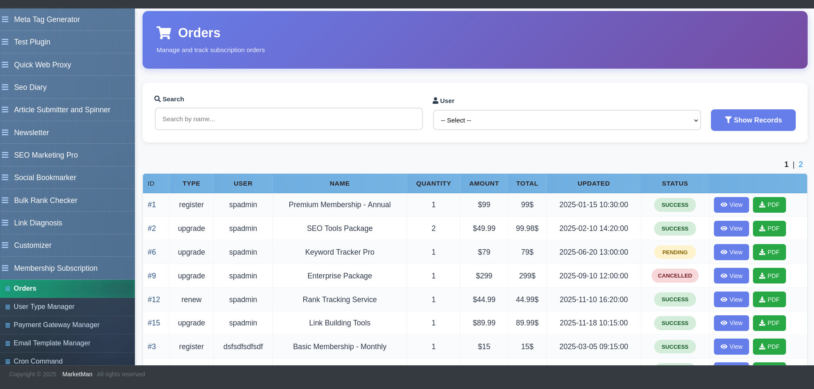
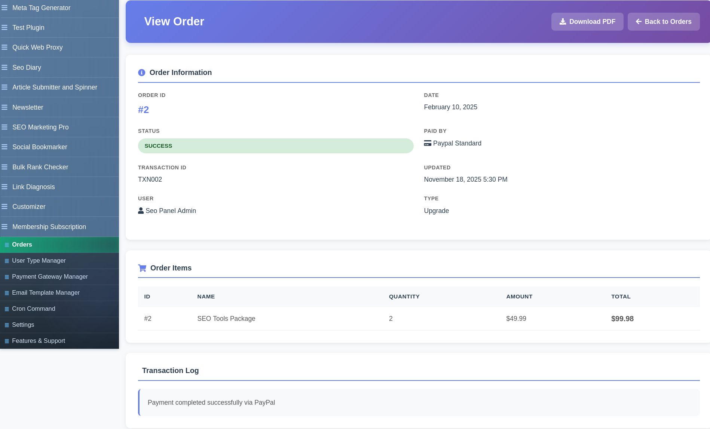
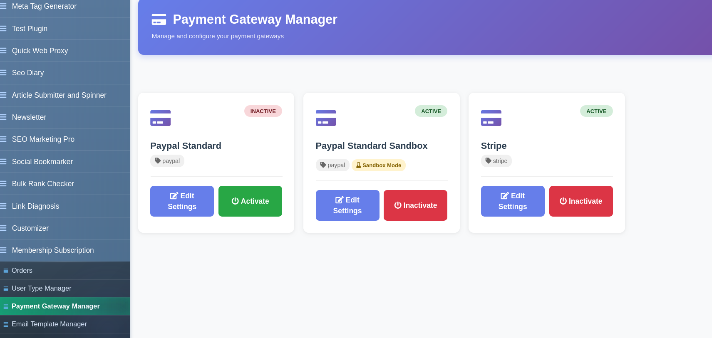
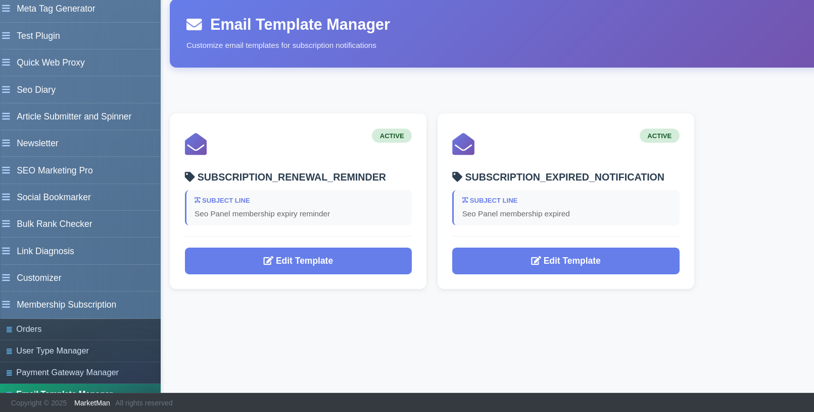

.. title:: Membership Subscription Plugin for SEO Panel | PayPal & Stripe Payment Integration

.. meta::
   :description: Membership Subscription plugin for SEO Panel manages user subscriptions, orders, invoices and payments via PayPal and Stripe with automated email notifications and cron-based renewal reminders.
   :keywords: membership subscription plugin, seo panel subscription, seo panel paypal stripe, user subscription management, invoice generator seo panel

Membership Subscription
~~~~~~~~~~~~~~~~~~~~~~~~

.. raw:: html

   

     

       

         <i class="fa fa-credit-card" style="color: #fff; font-size: 22px;"></i>
       

       

         

           Membership Subscription Plugin
           v3.0.0
         

         
Full subscription &amp; payment management with <strong style="color:#fff;">PayPal &amp; Stripe</strong> — orders, invoices &amp; automated renewals.

       

     

     <a href="https://www.seopanel.org/plugin/l/65/membership-subscription/" target="_blank"
        style="display: inline-flex; align-items: center; gap: 8px; background: #fff; color: #4c1d95; padding: 10px 22px; border-radius: 7px; font-weight: 700; font-size: 14px; text-decoration: none; box-shadow: 0 2px 8px rgba(0,0,0,0.18); white-space: nowrap; transition: opacity .2s;"
        onmouseover="this.style.opacity='.88'" onmouseout="this.style.opacity='1'">
       <i class="fa fa-download"></i> Download
     </a>
   

Membership Subscription is a comprehensive payment and subscription management plugin for SEO Panel. It enables you to sell access to SEO Panel user types (plans) via PayPal and Stripe, manage orders and payments, generate branded invoices, send automated email notifications, and run renewal reminders via cron — all from within SEO Panel.

The plugin menu provides the following sections:

- **Orders** – View and manage all subscription orders and payments
- **User Type Manager** – Define subscription plans and user type settings
- **Payment Gateway Manager** – Configure PayPal and Stripe (admin only)
- **Email Template Manager** – Customise transactional email templates (admin only)
- **Cron Command** – Automate renewal reminders (admin only)
- **Settings** – Global plugin configuration (admin only)

~~~~~~~~~~~~~~~~~~
Orders
~~~~~~~~~~~~~~~~~~

The Orders section lists all subscription purchases. Each order shows the user, plan (user type), amount, currency, payment gateway, payment status and order date.

**Filters:** Search by user or plan, filter by payment status and date range.

**Viewing an Order**

Click any order to view its full detail page, which includes:

- Order ID, user details, plan purchased
- Payment gateway used and transaction reference
- Payment status (Pending, Completed, Failed, Refunded)
- Invoice download link

**Order Actions**

- **View** – Open the full order detail and invoice
- **Mark as Paid** – Manually mark a pending order as completed
- **Delete** – Remove an order record

~~~~~~~~~~~~~~~~~~
User Type Manager
~~~~~~~~~~~~~~~~~~

User Type Manager (accessible via the sidebar link to SEO Panel's core User Types page) is where subscription plans are defined. Each user type becomes a purchasable plan. Configure the plan name, access permissions, pricing, billing period and trial options.

~~~~~~~~~~~~~~~~~~~~~~~~
Payment Gateway Manager
~~~~~~~~~~~~~~~~~~~~~~~~

Payment Gateway Manager (admin only) configures the payment providers used for checkout.

**Supported Gateways**

- **PayPal** – Configure with your PayPal Client ID and Client Secret. Supports sandbox mode for testing.
- **Stripe** – Configure with your Stripe Publishable Key and Secret Key. Supports test mode.

Each gateway card shows its current status (Active / Inactive) and a quick-edit button to update credentials. Toggle a gateway on or off without deleting its configuration.

~~~~~~~~~~~~~~~~~~~~~~
Email Template Manager
~~~~~~~~~~~~~~~~~~~~~~

Email Template Manager (admin only) lets you customise the transactional emails sent to users at key subscription lifecycle events.

**Available email templates include:**

- Order confirmation / payment received
- Subscription renewal reminder
- Subscription expiry notice
- Payment failed notification

Each template has a **Name**, **Subject** and rich-text **Email Body** (powered by TinyMCE). Use dynamic placeholders in the body to insert user-specific data such as name, plan, expiry date and invoice link.

To edit a template:

1. Click the template name
2. Update the **Subject** and **Email Body**
3. Click **Proceed** to save

~~~~~~~~~~~~
Cron Command
~~~~~~~~~~~~

The Cron Command section (admin only) provides the server command to automate subscription renewal reminder emails and expiry processing. Add the command to your server crontab.

Access via **Admin Panel → Membership Subscription → Cron Command** to get the pre-filled command for your installation path.

~~~~~~~~
Settings
~~~~~~~~

Plugin Settings (admin only) contains global configuration for currency, company details and payment behaviour. Update the values and click **Proceed** to save.
