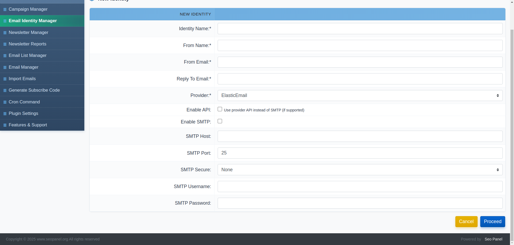
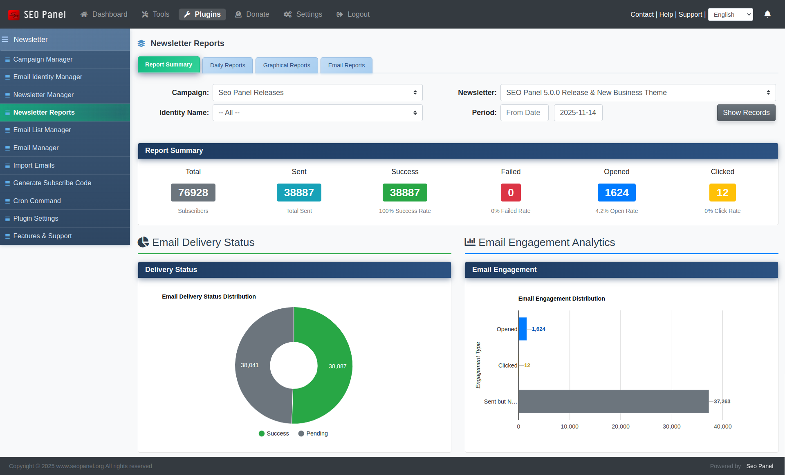
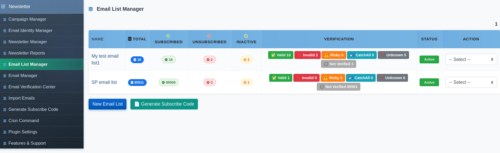
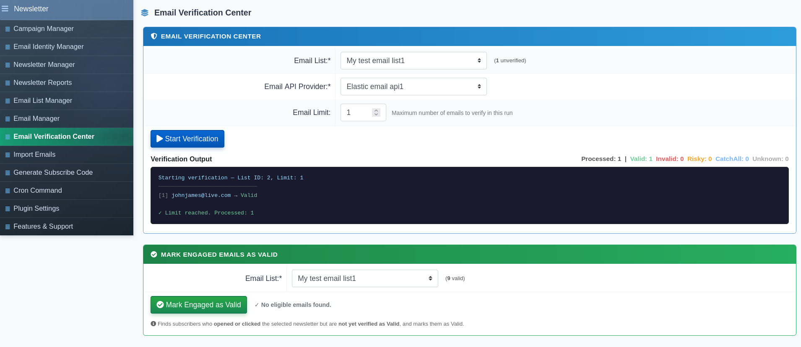
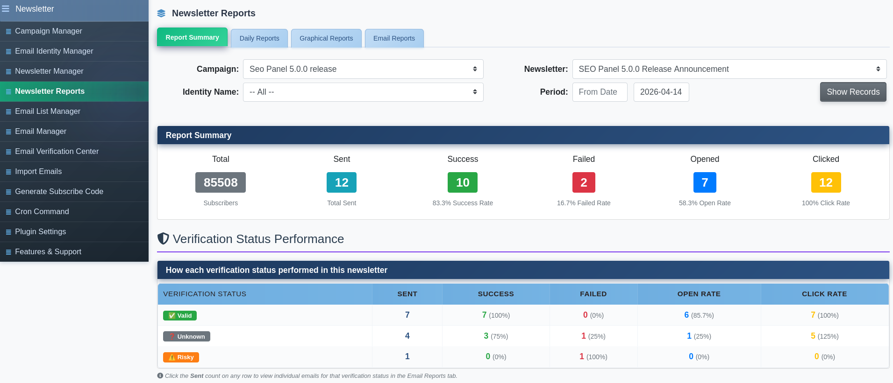
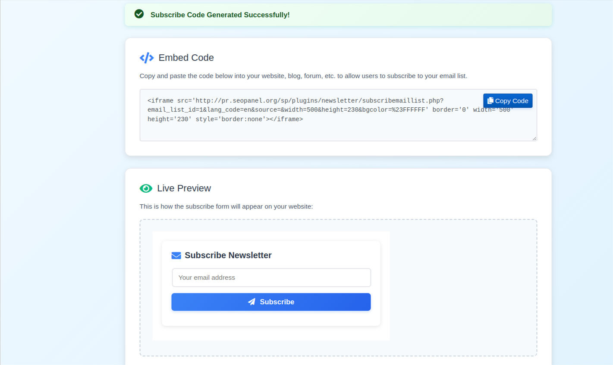

.. title:: Newsletter Plugin for SEO Panel | Email Marketing & Campaign Manager

.. meta::
   :description: Newsletter Plugin for SEO Panel lets you create, manage and send professional email campaigns with subscriber management, email verification, tracking and cron automation.
   :keywords: newsletter plugin seo panel, email marketing seo panel, email campaign manager, newsletter subscriber management, email verification, seo panel newsletter

Newsletter Plugin
~~~~~~~~~~~~~~~~~~

.. raw:: html

   

     

       

         <i class="fa fa-envelope" style="color: #fff; font-size: 22px;"></i>
       

       

         

           Newsletter Plugin
           v3.0.0
         

         
Full email marketing inside SEO Panel — <strong style="color:#fff;">campaigns, subscribers, verification &amp; tracking</strong> in one place.

       

     

     <a href="https://www.seopanel.org/plugin/l/19/newsletter-plugin/" target="_blank"
        style="display: inline-flex; align-items: center; gap: 8px; background: #fff; color: #b45309; padding: 10px 22px; border-radius: 7px; font-weight: 700; font-size: 14px; text-decoration: none; box-shadow: 0 2px 8px rgba(0,0,0,0.18); white-space: nowrap; transition: opacity .2s;"
        onmouseover="this.style.opacity='.88'" onmouseout="this.style.opacity='1'">
       <i class="fa fa-download"></i> Download
     </a>
   

Newsletter Plugin is a complete email marketing solution built into SEO Panel. Create and manage subscriber lists, design rich-text campaigns, configure multiple sending identities via SMTP or API, verify email addresses before sending, track opens and clicks, and automate delivery with cron jobs — all without leaving SEO Panel.

The plugin menu provides the following sections:

- **Campaign Manager** – Organise newsletters into campaigns per website
- **Email Identity Manager** – Configure sender addresses and email service providers
- **Newsletter Manager** – Create and manage individual newsletter editions
- **Newsletter Reports** – Track delivery, opens, clicks and email-level stats
- **Email List Manager** – Manage subscriber lists with verification status
- **Email Manager** – View and manage individual email addresses per list
- **Email Verification Center** – Verify email addresses via API before sending
- **Import Emails** – Bulk import subscribers from text or CSV
- **Generate Subscribe Code** – Embed a subscribe form on any website
- **Cron Command** – Set up automated newsletter delivery (admin only)
- **Plugin Settings** – Configure user permissions and content settings (admin only)

~~~~~~~~~~~~~~~~
Campaign Manager
~~~~~~~~~~~~~~~~

Campaigns group your newsletters by website. Each campaign is linked to one website and can have multiple newsletters and email identities assigned to it.

The list shows each campaign with its website, newsletter count (total and active), and assigned email identities.

**Creating a New Campaign**

1. Click **New Campaign**
2. Select the **Website**
3. Enter the campaign **Name**
4. Select one or more **Email Identities** to use for sending
5. Click **Proceed** to save

**Campaign Actions**

- **Send Newsletter** – Launch the send flow for this campaign
- **Newsletter Manager** – View newsletters within this campaign
- **Activate / Inactivate** – Toggle campaign status
- **Edit** – Modify campaign details
- **Delete** – Remove the campaign

~~~~~~~~~~~~~~~~~~~~~~
Email Identity Manager
~~~~~~~~~~~~~~~~~~~~~~

Email identities define the **From Name**, **From Email**, **Reply-To** address and sending method for your campaigns. Multiple identities can be created and assigned to different campaigns.

**Supported Email Providers**

The plugin supports 14 sending providers:

- Gmail, Yahoo Mail, Outlook
- SendGrid, Elastic Email, Amazon SES
- Mailgun, Mailjet, SparkPost, Postmark
- MSG91, Mailtrap, SMTP2GO
- Custom SMTP

**Creating a New Identity**

1. Click **New Identity**
2. Enter the **Identity Name** (internal label)
3. Enter the **From Name** shown to recipients
4. Enter the **From Email** address
5. Enter the **Reply To Email** address
6. Select the **Provider**
7. To use the provider's API — check **Enable API** and enter the **API Key**
8. To use SMTP — check **Enable SMTP** and enter:

   - **SMTP Host**
   - **SMTP Port** (default: 25)
   - **SMTP Secure** (None / SSL / TLS)
   - **SMTP Username**
   - **SMTP Password**

9. Click **Proceed** to save

**Identity Actions**

- **Activate / Inactivate** – Enable or disable the identity
- **Edit** – Modify any field
- **Delete** – Remove the identity

~~~~~~~~~~~~~~~~~~~~
Newsletter Manager
~~~~~~~~~~~~~~~~~~~~

Newsletter Manager is where individual newsletter editions are created. Each newsletter belongs to a campaign and targets one or more email lists.

The list shows each newsletter with its campaign, subscriber count, start date, end date, cron status and active status.

**Creating a New Newsletter**

1. Click **New Newsletter**
2. Select the **Campaign**
3. Enter the newsletter **Name** (internal label)
4. Enter the email **Subject**
5. Check **Enable HTML Mail** to use the rich TinyMCE editor for HTML content
6. Write the **Content** — supports images, links, tables and full formatting
7. Select one or more **Email Lists** to send to
8. Set the **Email Verification Filter** — choose which verification statuses to include (All, Valid, Risky, CatchAll, Unknown) or exclude unverified addresses
9. Set the **Start Date** (``YYYY-MM-DD``)
10. Set the **End Date** (``YYYY-MM-DD``)
11. Check **Enable Clicks Tracking** to track link clicks in the newsletter
12. Check **Enable Email Open Tracking** to track email opens
13. Click **Proceed** to save

**Newsletter Actions**

- **Send Newsletter** – Start the send process for this newsletter
- **View Subscribers** – See the list of subscribers targeted by this newsletter
- **Reports** – View delivery and engagement reports for this newsletter
- **Activate / Inactivate** – Toggle newsletter status
- **Edit** – Modify any field
- **Delete** – Remove the newsletter

~~~~~~~~~~~~~~~~~~~~
Newsletter Reports
~~~~~~~~~~~~~~~~~~~~

Newsletter Reports provides full visibility into campaign performance. Filter by Campaign, Newsletter, Identity and Date Range.

**Report Type Tabs**

- **Email Reports** – Per-email delivery log showing each recipient address, send time and status (Sent, Failed, Bounced, etc.)
- **Daily Reports** – Day-by-day breakdown of emails sent, opens and clicks
- **Graphical Reports** – Visual charts of delivery trends, open rates and click rates
- **Report Summary** – Aggregated totals for the selected newsletter including total sent, opens, unique opens, clicks and unique clicks

~~~~~~~~~~~~~~~~~~
Email List Manager
~~~~~~~~~~~~~~~~~~

Email List Manager organises your subscribers into named lists. Each list entry shows:

- **Total** – Total emails in the list (clickable — jumps to Email Manager)
- **Subscribed** – Active subscribers
- **Unsubscribed** – Emails that have opted out
- **Inactive** – Inactive email records
- **Verification** – Breakdown by verification result: Valid ✅, Invalid ❌, Risky ⚠️, CatchAll 📬, Unknown ❓, Not Verified 🔘 (each count is clickable and filters Email Manager)

**Creating a New Email List**

1. Click **New Email List**
2. Enter a **Name** for the list
3. Click **Proceed**

**Email List Actions**

- **Import Emails** – Bulk-import subscribers into this list
- **Email Manager** – View and manage individual addresses
- **Generate Subscribe Code** – Create an embeddable subscribe form for this list
- **Activate / Inactivate** – Toggle the list's active status
- **Edit** – Rename the list
- **Delete** – Remove the list and all its subscriber records

~~~~~~~~~~~~~~
Email Manager
~~~~~~~~~~~~~~

Email Manager shows the individual email addresses inside a selected list. You can filter by subscribed, unsubscribed, inactive, or verification result status directly from the Email List Manager badges.

Each address entry shows the name (if provided), subscription status, verification result and the date added. Individual addresses can be edited or deleted from the action dropdown.

~~~~~~~~~~~~~
Import Emails
~~~~~~~~~~~~~

Import Emails lets you bulk-add subscribers into any email list from a text input or a CSV file.

**Importing via text**

Paste email addresses into the **Email Addresses** field, one per line. If you have a name, add it after a comma:

.. code-block:: text

   smithpatrick@gmail.com,Smith Patrick
   kellythomas@yahoo.com,Kelly Thomas
   johnjames@live.com,
   jean4u@gmail.com,Jean Alwin

**Importing via CSV**

Upload a ``.csv`` file using the **Email Addresses CSV File** field. Click **Sample CSV File** to download the correct format.

After selecting the **Email List** and supplying the data, click **Proceed** to import. An import summary reports the count of **Valid**, **Invalid** and **Duplicate** addresses processed.

~~~~~~~~~~~~~~~~~~~~~~~~~
Email Verification Center
~~~~~~~~~~~~~~~~~~~~~~~~~

The Email Verification Center validates email addresses in a list against an email API provider before sending, so you only send to deliverable addresses.

**How to Verify**

1. Select the **Email List** to verify
2. Select the **Email API Provider** (an Elastic Email identity with API enabled)
3. Set the **Email Limit** — the maximum number of addresses to verify in one run (default: 50)
4. Click **Start Verification**

A live console streams verification output as each address is checked. Click **Stop** to pause at any time.

Each address is classified as one of:

- **Valid** – Address exists and accepts mail
- **Invalid** – Address does not exist or is undeliverable
- **Risky** – Address exists but has a high bounce risk
- **CatchAll** – Domain accepts all mail; deliverability uncertain
- **Unknown** – Could not be determined

After verification, the result for each address is saved and appears in the Email List Manager badges. Use the **Email Verification Filter** in the Newsletter Manager to target only the addresses with verification results you trust.

~~~~~~~~~~~~~~~~~~~~~~~
Generate Subscribe Code
~~~~~~~~~~~~~~~~~~~~~~~

Generate Subscribe Code creates an embeddable subscribe form that you can add to any external website or page, allowing visitors to join your email list directly.

**Generating a Subscribe Code**

1. Select the **Email List** subscribers will be added to
2. Select the **Language** for the form labels
3. Enter a **Source** tag to identify where subscribers came from (e.g. ``website``, ``blog``, ``landing-page``)
4. Set the form **Width** in pixels (default: 500)
5. Set the form **Height** in pixels (default: 230)
6. Click **Generate**

The output provides:

- An **iframe embed code** to paste into any HTML page
- A direct **subscribe form URL** for linking or testing

~~~~~~~~~~~~
Cron Command
~~~~~~~~~~~~

The Cron Command section (admin only) provides the command to automate newsletter delivery. Add the command to your server's crontab to send scheduled newsletters without manual intervention.

Access it via **Admin Panel → Newsletter Plugin → Cron Command** to get the exact path pre-filled for your installation.

A typical daily cron entry looks like:

.. code-block:: bash

   0 * * * * php /path/to/seopanel/plugins/newsletter/cron.php

Adjust the schedule pattern to match how frequently you want newsletters to be dispatched.

~~~~~~~~~~~~~~~
Plugin Settings
~~~~~~~~~~~~~~~

Plugin Settings (admin only) controls user access and content configuration.

Available settings:

- **Allow user to access the campaign manager** – When enabled, non-admin users can access Campaign Manager, Newsletter Manager, Reports, Email Lists and the Verification Center
- **Allow user to access system email server** – When enabled, non-admin users can use the system-level email server for sending
- **Newsletter content wordwrap length** – The character width at which newsletter plain-text content wraps (default: 70)

To update a setting, change the value and click **Proceed**.
