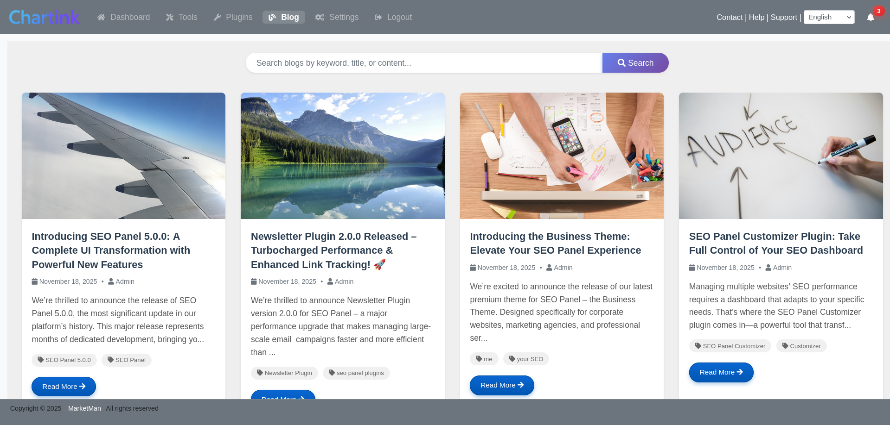
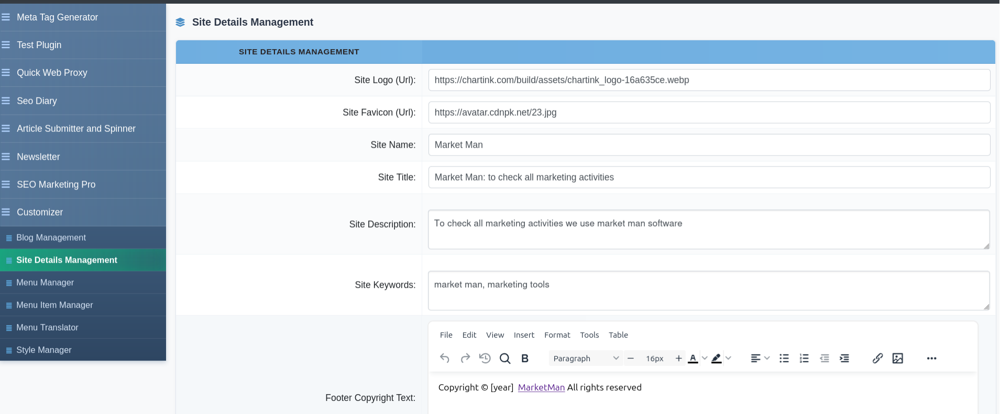
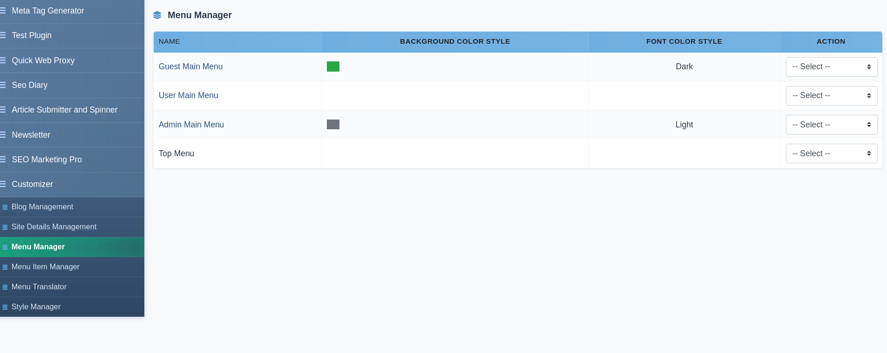
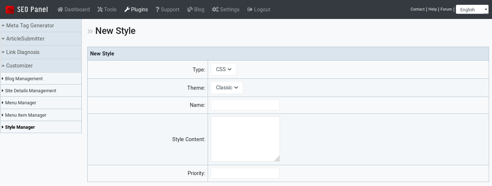

.. title:: SEO Panel Customizer Plugin | Customize Logo, Menus, Styles & Pages

.. meta::
   :description: SEO Panel Customizer plugin lets you customize your SEO Panel installation — logo, site name, menus, custom pages, CSS/JS styles and more.
   :keywords: seo panel customizer plugin, customize seo panel, seo panel logo customizer, seo panel menu manager, seo panel style manager

Seo Panel Customizer
~~~~~~~~~~~~~~~~~~~~

.. raw:: html

   

     

       

         <i class="fa fa-paint-brush" style="color: #fff; font-size: 22px;"></i>
       

       

         

           SEO Panel Customizer Plugin
           v5.0.0
         

         
Customize SEO Panel's <strong style="color:#fff;">logo, menus, styles</strong> &amp; content pages to match your brand perfectly.

       

     

     <a href="https://www.seopanel.org/plugin/l/110/customizer/" target="_blank"
        style="display: inline-flex; align-items: center; gap: 8px; background: #fff; color: #9d174d; padding: 10px 22px; border-radius: 7px; font-weight: 700; font-size: 14px; text-decoration: none; box-shadow: 0 2px 8px rgba(0,0,0,0.18); white-space: nowrap; transition: opacity .2s;"
        onmouseover="this.style.opacity='.88'" onmouseout="this.style.opacity='1'">
       <i class="fa fa-download"></i> Download
     </a>
   

Customizer plugin for SEO Panel lets you fully rebrand and personalise your SEO Panel installation. Change the logo, site name, navigation menus, custom page content, social links, and inject custom CSS or JavaScript — all without touching the core code.

The plugin menu provides the following sections:

- **Blog Management** – Create custom content pages to replace Home, Support and About Us
- **Site Details Management** – Update logo, favicon, site name, title, meta tags and social links
- **Menu Manager** – Customise navigation menu colours for Guest, User and Admin menus
- **Menu Item Manager** – Add, edit and reorder menu items across all menus
- **Menu Translator** – Translate menu item labels into multiple languages
- **Style Manager** – Inject custom CSS or JavaScript for any installed theme

~~~~~~~~~~~~~~~
Blog Management
~~~~~~~~~~~~~~~

Blog Management lets you create rich content pages that can replace the default **Home**, **Support** and **About Us** pages of your SEO Panel installation. Each blog supports multilingual content, SEO meta fields and a feature image.

The blog list can be filtered by **Keyword**, **Status** (Active / Inactive) and **Link Page** (Home, Support, About Us).

**Creating a New Blog**

To create a new blog:

1. Click **Add New Blog**

2. Enter a **Blog Title**

3. Write the **Blog Content** using the built-in TinyMCE rich text editor (supports images, links, tables, code blocks and more)

4. Optionally upload a **Feature Image** (JPG, PNG or GIF — recommended 1200×630 px)

5. Enter a **Blog Meta Title** (50–60 characters recommended)

6. Enter a **Blog Meta Description** (150–160 characters recommended)

7. Enter **Blog Meta Keywords** (comma-separated)

8. Select the **Language**

9. Enter **Tags** (comma-separated)

10. Select the **Replace Page** — choose which default page this blog will replace:

    - **Home** — replaces the SEO Panel home page
    - **Support** — replaces the support page
    - **About Us** — replaces the about us page

11. Click **Proceed** to save

**Blog Actions**

Each blog in the list supports the following actions:

- **Activate / Inactivate** – Toggle the blog's published status
- **Edit** – Modify any blog field
- **Delete** – Remove the blog permanently

~~~~~~~~~~~~~~~~~~~~~~~
Site Details Management
~~~~~~~~~~~~~~~~~~~~~~~

Site Details Management lets you customise the core branding and identity of your SEO Panel installation.

The following fields are available:

- **Site Logo (URL)** – URL to your logo image (recommended size: 131×31 px)
- **Site Favicon (URL)** – URL to your favicon file
- **Site Name** – Display name shown in the panel header (max 25 characters)
- **Site Title** – Browser tab title for the panel
- **Site Description** – Meta description for the panel's home page
- **Site Keywords** – Meta keywords for the panel's home page
- **Footer Copyright Text** – Custom footer text with rich-text editor support; use ``[year]`` as a placeholder for the current year
- **Facebook Page URL** – Link to your Facebook page shown in the panel
- **Twitter Page URL** – Link to your Twitter/X page
- **Contact URL** – URL for the Contact link in the panel
- **Help URL** – URL for the Help link
- **Support URL** – URL for the Support link
- **Disable News** – Check to hide the news feed from the panel
- **Custom Menu** – Check to activate custom menu items defined in Menu Item Manager

Click **Proceed** to save all changes.

~~~~~~~~~~~~
Menu Manager
~~~~~~~~~~~~

Menu Manager displays the four navigation menus available in SEO Panel and lets you customise their visual appearance.

The four menus are:

- **Guest Menu** – Shown to logged-out visitors
- **User Menu** – Shown to regular logged-in users
- **Admin Menu** – Shown to administrators
- **Top Menu** – The top navigation bar (colour not customisable)

For each menu (except Top) you can set:

- **Background Color Style** – The background colour class for the menu bar
- **Font Color Style** – The text colour for menu links

Click the menu name or select **Edit** from the action dropdown to change its colours, then click **Proceed** to save.

Selecting **Menu Item Manager** from the action dropdown jumps directly to the items for that menu.

~~~~~~~~~~~~~~~~~
Menu Item Manager
~~~~~~~~~~~~~~~~~

Menu Item Manager lets you add custom navigation links to any of the SEO Panel menus.

To create a new menu item:

1. Click **New Menu Item**

2. Select the **Menu** (Guest, User, Admin or Top)

3. Enter the **Name** (label shown in the menu)

4. Enter the **URL** the item links to

5. Set the **Float Type** — ``left`` or ``right`` alignment within the menu

6. Set the **Priority** — lower numbers appear first

7. Set the **Window Target** — ``_self`` to open in the same tab, ``_blank`` to open in a new tab

8. Click **Proceed** to save

**Menu Item Actions**

- **Activate / Inactivate** – Show or hide the item in the menu
- **Edit** – Modify any field
- **Menu Translation** – Add translated labels for this item in other languages
- **Delete** – Remove the item

~~~~~~~~~~~~~~~
Menu Translator
~~~~~~~~~~~~~~~

Menu Translator lets you provide translated labels for custom menu items so users see the navigation in their own language.

To add or update translations for a menu item:

1. Select the **Menu Item** from the dropdown

2. Click **Search**

3. Enter the translated text for each available language

4. Click **Proceed** to save

~~~~~~~~~~~~~
Style Manager
~~~~~~~~~~~~~

Style Manager lets you inject custom **CSS** or **JavaScript** into any installed SEO Panel theme — useful for visual tweaks, branding overrides or adding third-party widgets without modifying theme files.

The style list can be filtered by **Theme** and **Type** (CSS or JS).

To create a new style:

1. Click **New Style**

2. Select the **Type** — ``css`` or ``js``

3. Select the **Theme Name** the style applies to

4. Enter a **Name** to identify this style entry

5. Enter the custom **Content** (CSS rules or JavaScript code)

6. Set the **Priority** — lower numbers are applied first

7. Click **Proceed** to save

**Style Actions**

- **Activate / Inactivate** – Enable or disable the style without deleting it
- **Edit** – Modify the style content or settings
- **Delete** – Remove the style permanently
