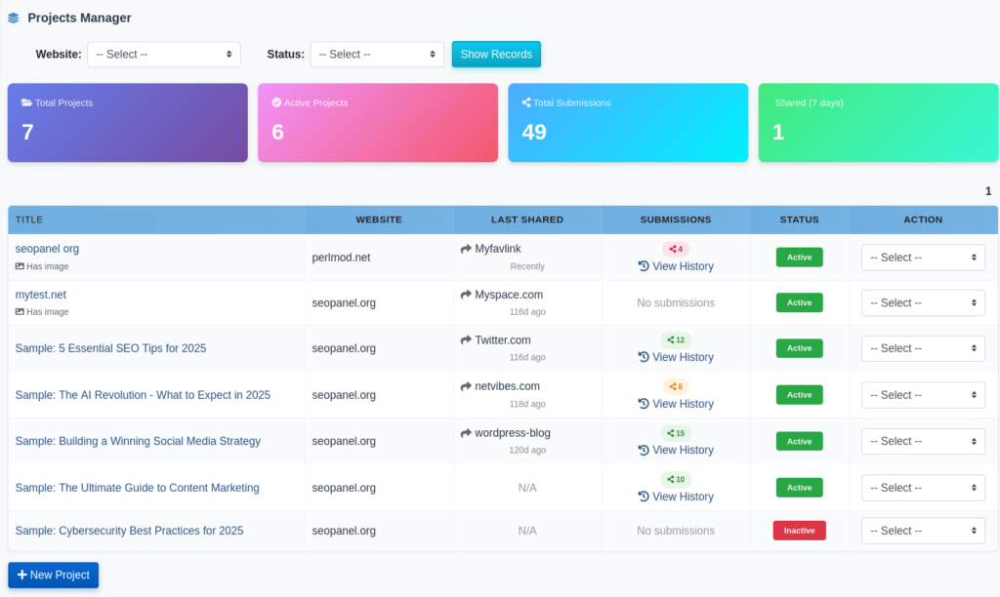

.. title:: Social Bookmarker Plugin for SEO Panel | Share Links to 150+ Social Networks

.. meta::
   :description: Social Bookmarker is an SEO Panel plugin to share your links across 150+ social networking sites like Facebook, Twitter, LinkedIn, Pinterest, Reddit, Threads and WhatsApp in minutes.
   :keywords: social bookmarker plugin, seo panel social bookmarker, social bookmarking tool, share links social networks, social bookmarking seo, seo panel plugin

Social Bookmarker
~~~~~~~~~~~~~~~~~~

.. raw:: html

   

     

       

         <i class="fa fa-share-alt" style="color: #fff; font-size: 22px;"></i>
       

       

         

           Social Bookmarker Plugin
           v2.0.0
         

         
Share links to <strong style="color:#fff;">150+ social networks</strong> directly from SEO Panel &mdash; fast &amp; fully automated.

       

     

     <a href="https://www.seopanel.org/plugin/l/18/social-bookmarker/" target="_blank"
        style="display: inline-flex; align-items: center; gap: 8px; background: #fff; color: #6d28d9; padding: 10px 22px; border-radius: 7px; font-weight: 700; font-size: 14px; text-decoration: none; box-shadow: 0 2px 8px rgba(0,0,0,0.18); white-space: nowrap; transition: opacity .2s;"
        onmouseover="this.style.opacity='.88'" onmouseout="this.style.opacity='1'">
       <i class="fa fa-download"></i> Download
     </a>
   

Social Bookmarker is a powerful SEO Panel plugin that enables quick sharing of your links across top social networking and bookmarking sites including Facebook, Twitter/X, LinkedIn, Pinterest, Reddit, Threads, WhatsApp, Telegram, Bluesky, and many more.

There are about 150 social networking sites available with this plugin. It helps you submit your links to these sites within a short period of time — boosting traffic, backlinks, and brand visibility simultaneously.

The plugin menu provides the following sections:

- **Projects Manager** – Create and manage social bookmarking campaigns
- **Run Project** – Submit a project's link to social bookmarking sites
- **Social Bookmarker Manager** – Manage the list of social bookmarking sites
- **Plugin Settings** – Configure plugin-level settings

~~~~~~~~~~~~~~~~
Projects Manager
~~~~~~~~~~~~~~~~

Projects Manager is used to create and manage social bookmarking projects. Each project holds the details of a link you want to share across social networks.

The Projects Manager dashboard shows summary statistics cards at the top:

- **Total Projects** – Total number of projects created
- **Active Projects** – Number of currently active projects
- **Total Submissions** – Cumulative number of submissions made across all projects
- **Shared (7 days)** – Number of submissions made in the last 7 days

**Creating a New Project**

To create a new project:

1. Click on **New Project**

2. Select the **Website** the project belongs to

3. Enter the **URL** of the page you want to share. You can click the **Crawl** button to automatically fetch the page's meta title and description.

4. Enter a **Title** for the share

5. Enter a **Description** for the share

6. Enter **Tags** (comma-separated keywords)

7. Optionally upload a **Feature Image** (JPG, PNG or GIF, up to 5 MB) or enter a public **Image URL** — used by social sites that support image sharing

8. Click **Proceed** to save the project

The project list shows each project with its website, last shared site, submission count, and status. You can click **View History** on any project to see its full submission timeline.

**Project Actions**

Each project in the list supports the following actions from the action dropdown:

- **Run Project** – Launch the submission process for that project
- **Activate / Inactivate** – Toggle the project status
- **Edit** – Modify the project details
- **Delete** – Remove the project

~~~~~~~~~~~
Run Project
~~~~~~~~~~~

Run Project is used to submit a project's link to social bookmarking sites. Select the website, project, and social bookmarking site, then click **Submit**.

To run a project:

1. Select the **Website**

2. Select the **Project**

3. Select the **Social Bookmarker** (the social networking site to submit to)

4. Click **Submit**

The submission interface opens with navigation tabs:

- **Login** – Log in to the selected social site
- **Submit** – Submit the link (the site's submission page loads in an iframe or a popup window)
- **Register** – Register for the selected social site if you don't have an account

Use the **Previous** and **Next** buttons to cycle through social bookmarking sites in sequence, enabling rapid submission to multiple sites in one session.

.. note::
   If a project uses a locally uploaded feature image, a warning is displayed when the selected social site uses the ``[[image]]`` parameter. To resolve this, edit the project and replace the uploaded image with a publicly accessible image URL.

~~~~~~~~~~~~~~~~~~~~~~~~~
Social Bookmarker Manager
~~~~~~~~~~~~~~~~~~~~~~~~~

Social Bookmarker Manager shows the full list of social bookmarking and networking sites registered in the plugin. Each entry includes the site name, submit link template, rank, and status.

**Searching and Filtering**

Use the search box to filter sites by name and the status dropdown to filter by Active or Inactive status.

**Site Actions**

Each site supports the following actions:

- **Activate / Inactivate** – Toggle the site's availability for project submission
- **Edit** – Modify the site's name, submit link, register link, login link, rank, iframe setting, and status
- **Delete** – Remove the site from the list

**Adding a New Social Bookmarking Site**

To add a custom social bookmarking site:

1. Click **New Social Bookmarker**

2. Enter the **Engine Name** (display name of the site)

3. Enter the **Submit Link** — the URL template used for submitting. Use the following placeholders:

   - ``[[url]]`` – replaced with the project's share URL
   - ``[[title]]`` – replaced with the project's share title
   - ``[[description]]`` – replaced with the project's share description
   - ``[[tags]]`` – replaced with the project's share tags
   - ``[[image]]`` – replaced with the project's feature image URL

4. Enter the **Register Link** – the URL to register for the site

5. Enter the **Login Link** – the URL to log in to the site

6. Set the **Rank** (lower number = higher priority)

7. Set **iFrame** to Yes if the site can load inside an iframe, or No to open in a popup

8. Set **Status** to Active or Inactive

9. Click **Proceed** to save

**Verifying All Sites**

Click **Verify All** to run a check on all registered social bookmarking sites and confirm which ones are still active and reachable.

~~~~~~~~~~~~~~~~~~
Submission History
~~~~~~~~~~~~~~~~~~

Every project maintains a full submission history. Click **View History** next to any project in the Projects Manager to see the complete submission timeline.

The history page shows:

- A **project summary** with the share URL and website name
- **Statistics** – Total submissions, Successful, Skipped, and Failed counts
- A **timeline** of individual submissions, each showing:

  - The social bookmarking site name
  - Date and time of submission (with relative time, e.g. "3d ago")
  - Submission status: **Submitted**, **Skipped**, or **Failed**
  - Any notes associated with the submission

~~~~~~~~~~~~~~~
Plugin Settings
~~~~~~~~~~~~~~~

Plugin Settings allow administrators to control user access permissions for the plugin.

The following settings are available:

- **Allow user to access project manager** – When enabled, non-admin users can access the Projects Manager and Run Project sections
- **Allow user to access social bookmarker manager** – When enabled, non-admin users can access the Social Bookmarker Manager

To update settings:

1. Select **Yes** or **No** for each option

2. Click **Proceed** to save

~~~~~~~~~~~~~~~~~~~~~~~~~~~~~~~~~~~~~
Supported Social Bookmarking Networks
~~~~~~~~~~~~~~~~~~~~~~~~~~~~~~~~~~~~~

The plugin comes pre-loaded with approximately 150 social bookmarking and networking sites. Active sites include:

- Threads
- WhatsApp
- Twitter / X
- Microsoft Teams
- Weibo
- Skype
- Facebook
- LinkedIn
- Pinterest
- Reddit
- Tumblr
- Telegram
- Bluesky
- Pocket
- Mastodon
- Mix
- Flipboard
- Instapaper
- Buffer
- Diigo
- And many more

Custom sites can be added at any time through the Social Bookmarker Manager.
