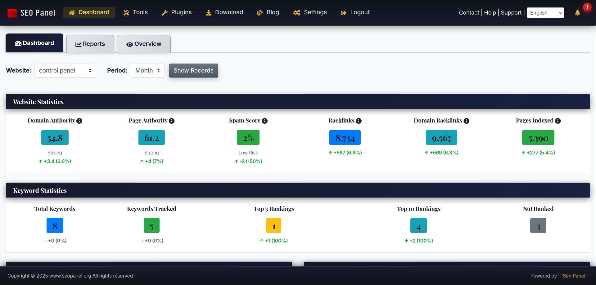
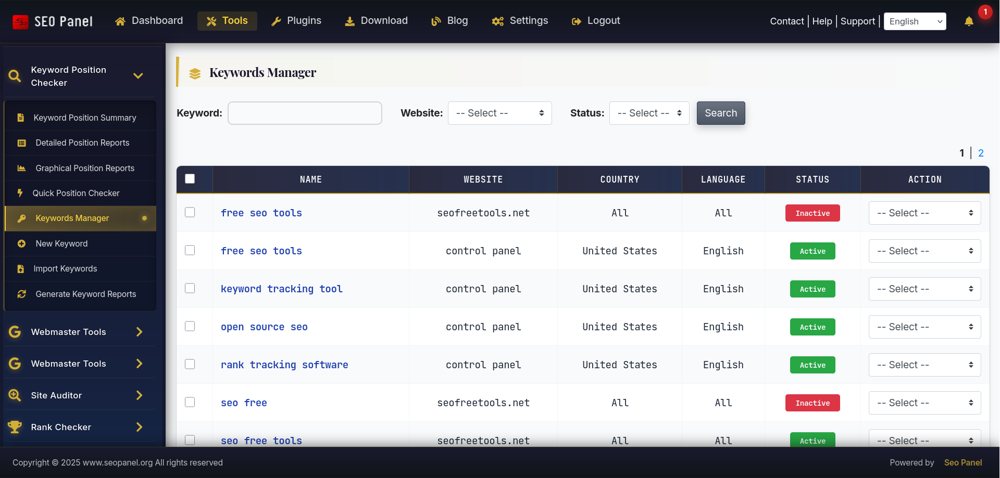
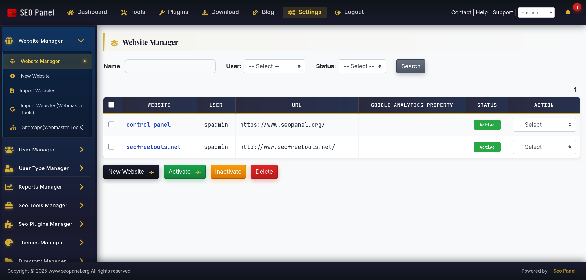

.. title:: Business Theme for SEO Panel | Professional Navy & Gold Corporate Design

.. meta::
   :description: Business Theme for SEO Panel delivers a premium corporate look with navy and gold colours, 10 custom SVG graphics, animated UI components, WCAG AA compliant contrast and full responsive design.
   :keywords: seo panel business theme, seo panel premium theme, navy gold seo panel theme, corporate seo panel theme, professional seo panel design

Business Theme
~~~~~~~~~~~~~~

.. raw:: html

   

     

       

         <i class="fa fa-briefcase" style="color: #d4af37; font-size: 22px;"></i>
       

       

         

           Business Theme
           v6.0.0
           Premium
         

         
Enterprise-level aesthetics — <strong style="color:#f4d03f;">navy &amp; gold</strong> with 10 custom SVGs, animations &amp; WCAG AA contrast.

       

     

     <a href="https://www.seopanel.org/theme/l/157/business-theme/" target="_blank"
        style="display: inline-flex; align-items: center; gap: 8px; background: #d4af37; color: #1a1a2e; padding: 10px 22px; border-radius: 7px; font-weight: 700; font-size: 14px; text-decoration: none; box-shadow: 0 2px 8px rgba(0,0,0,0.3); white-space: nowrap; transition: opacity .2s;"
        onmouseover="this.style.opacity='.88'" onmouseout="this.style.opacity='1'">
       <i class="fa fa-download"></i> Download
     </a>
   

Business Theme transforms SEO Panel into a polished, enterprise-grade interface with a deep navy and gold colour scheme. It ships with 10 original SVG graphics, 3 custom CSS animations, 25+ gradient combinations, and enhanced styling across every UI component — from tables and buttons to alerts, forms and section headers.

**Author:** SEO Panel Team

**Price:** Premium (one-time purchase)

**Colour scheme:** Dark navy (``#1a1a2e``) primary, classic gold (``#d4af37``) accent, white content areas.

**Best for:** Corporate websites, marketing agencies, professional services, B2B applications, and anyone who wants a premium interface distinct from the default Classic theme.

~~~~~~~~~~~
Key Features
~~~~~~~~~~~

**Custom SVG Graphics Package (10 files)**

- **Professional Logo** — shield-style design with navy gradient, gold "S" lettermark and "BUSINESS" badge
- **Hero Pattern Background** — geometric grid with dot matrix, decorative hexagons and diagonal gold accent lines
- **Animated Button Icons** — arrow with gold gradient that slides right on hover
- **Dashboard Menu Icon** — 4-grid layout with gold gradient
- **Analytics Menu Icon** — bar chart with trend line overlay
- **Settings Menu Icon** — professional gear with 8-spoke gold gradient
- **Corner Accent** — triangular gold gradient for card corners
- **Card Accent Bar** — navy-to-gold-to-navy horizontal gradient stripe
- **Success Badge** — green circular badge with white checkmark for success alerts
- **Error Badge** — red circular badge with white X for error alerts

**Enhanced UI Components**

- **Buttons** — animated arrow icons that slide on hover, stronger drop shadows
- **Tables** — gold top border accent, gold left border appears on row hover
- **Section Headers** — gold left border with gradient background
- **Alerts** — custom badge icons (success/error), enhanced left padding
- **Forms** — gold focus glow animation on all input fields
- **Progress Bars** — infinite shimmer animation
- **Cards** — subtle corner decorations and gradient accent bars
- **Pagination** — card-style with gold hover states
- **Info Boxes** — enhanced borders, depth shadows and bottom accent

**Animations (3 custom keyframes)**

- ``slideArrow`` — button arrow slides right on hover
- ``shimmer`` — progress bar sweep effect
- ``glowPulse`` — gold glow on focused form elements

**Accessibility**

- WCAG AA compliant colour contrast throughout
- High contrast focus states for keyboard navigation
- Works on all modern browsers

**Responsive Design**

- Fully responsive layout optimised for all screen sizes
- Lightweight SVGs (1–3 KB each) for fast loading

~~~~~~~~~~~~~~~~~~
Theme Statistics
~~~~~~~~~~~~~~~~~~

.. raw:: html

   

     

       
5,192

       
CSS Lines

     

     

       
10

       
Custom SVG Files

     

     

       
25+

       
Gradients

     

     

       
3

       
CSS Animations

     

     

       
20+

       
Enhanced Components

     

   

~~~~~~~~~~~~~
How to Install
~~~~~~~~~~~~~

1. Purchase and download the Business Theme zip from `seopanel.org <https://www.seopanel.org/theme/l/157/business-theme/>`_
2. Log in to SEO Panel and go to **Admin Panel → Themes Manager**
3. Click **Install New Theme**
4. Upload the downloaded zip file
5. Once installed, click **Activate** to apply the theme

To upgrade an existing installation to a newer version, download the latest zip and select **Upgrade** from the theme's action dropdown in Themes Manager.

.. note::
   If you use the SEO Panel Customizer plugin to set a custom logo URL, the Business Theme logo will be overridden by your custom logo, which takes precedence.
